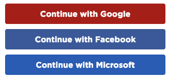

# Overview

To get started we'll create a GameLab account on Code.Org. Check out the learning targets, then head over the Instructions tab and follow along as we set up our accounts.

<!-- Don't edit links here, change them in _data/assignment.yml instead, -->

[lesson]: <{{site.data.assignment.lesson}}>     
[slides]:   <{{site.data.assignment.slides}}>   
[template]: <{{site.data.assignment.template}}> 
